# 🗞️ InFact Platform - AI-Powered News Desensationalization Engine

[](https://ballerina.io/)
[](https://www.python.org/downloads/)
[](https://fastapi.tiangolo.com/)
[](https://www.mongodb.com/)
[](https://opensource.org/licenses/MIT)

> **Transform sensationalized news into factual, neutral reporting through advanced AI and NLP techniques**

A full-stack news processing and analysis platform that extracts facts from news articles, clusters similar content, and presents desensationalized information through a modern architecture. Tired of clickbait headlines and biased spins? InFact cuts through the noise to deliver just the facts—because who has time for drama in their daily news?

Built with **Ballerina** for robust API gateway services and **Python FastAPI** for advanced AI processing pipelines.

🔗 **[Original InFact Implementation](https://github.com/LazySeaHorse/Infact)**


---


## 🔍 Overview

InFact is your ultimate shield against sensationalized news! This platform automatically pulls articles from RSS feeds and external APIs, processes them with cutting-edge NLP to separate facts from opinions, clusters similar stories, and generates neutral summaries using AI. Built by a talented team from Sri Lanka, it's perfect for journalists, researchers, or anyone who wants unbiased information without the hype.

### 🏗️ Architecture

This implementation features a **dual-service architecture**:

- **🔄 Ballerina Gateway**: High-performance API gateway handling news aggregation, routing, and client interactions
- **🧠 Python Pipeline**: Advanced AI/ML processing engine for clustering, fact extraction, and content generation

```
📁 InFact Platform/
├── 🔄 ballerina-gateway/          # Ballerina API Gateway
│   ├── main.bal                   # Main service endpoints
│   ├── modules/
│   │   ├── config/                # Database & API configuration
│   │   ├── types/                 # Data models & schemas
│   │   └── utils/                 # Business logic utilities
│   └── Config.toml                # Environment configuration
│
├── 🧠 python-pipeline/            # AI Processing Engine
│   ├── main.py                    # FastAPI application entry
│   ├── core/                      # Configuration & database
│   ├── schemas/                   # Pydantic data models
│   ├── services/                  # API endpoints & business logic
│   └── utils/                     # NLP & AI processing tools
│
├── 📊 frontend/                   # React Frontend (Optional)
└── 📓 notebook/                   # Research & Development
```

---

## ✨ Key Features

### 🧠 **AI-Powered Processing**
- **Smart Article Clustering** - Groups related news stories using semantic similarity
- **Fact vs Opinion Classification** - Separates factual information from editorial content  
- **Neutral Article Generation** - Creates unbiased summaries using Google Gemini AI
- **Sentiment Analysis** - Identifies and neutralizes emotional language
- **Duplicate Detection** - Automatic duplicate article detection and filtering

### 🔍 **Advanced Analytics**
- **Trending Topic Detection** - Identifies emerging news patterns
- **Source Bias Analysis** - Tracks how different outlets cover the same story
- **Real-time Statistics** - Comprehensive metrics and insights
- **Similarity Scoring** - ML-based content similarity detection
- **Weekly Digests** - Automated news summaries

### 🏗️ **Production Architecture**
- **Ballerina Gateway** - Enterprise-grade API gateway with robust routing
- **Async FastAPI Backend** - High-performance Python processing with background tasks
- **MongoDB Integration** - Scalable document storage with intelligent clustering
- **Modular Design** - Clean separation of concerns with comprehensive error handling
- **RSS Feed Automation** - Automated news ingestion from configurable sources

### 📊 **Rich Data Management**
- **URL Tracking** - Maintains links to original sources
- **Image Processing** - Automatic image selection for clusters
- **Multi-source Aggregation** - Combines articles from multiple news outlets
- **Historical Analysis** - Tracks news evolution over time
- **Search & Filtering** - Advanced query capabilities

---

## 🚀 Quick Start

### Prerequisites
- **Ballerina 2201.8.0+** ([Download here](https://ballerina.io/))
- **Python 3.11+**
- **MongoDB 5.0+** (local or cloud)
- **Google Gemini API Key** ([Get one here](https://aistudio.google.com/app/apikey))
- **News API Key** ([Get one here](https://newsapi.org/))

### 1. Clone & Setup

```bash
# Clone the repository
git clone <repository-url>
cd infact-ballerina
```

### 2. Configure Services

#### Ballerina Gateway Configuration
```bash
cd ballerina-gateway

# Create Config.toml
cat > Config.toml << EOF
[ballerina_gateway.config]
mongoUri = "mongodb://localhost:27017"
databaseName = "newsstore"

[ballerina_gateway.utils]
newsApiKey = "your-news-api-key-here"
EOF
```
#### Ballerina Gateway Configuration

For detailed setup instructions, please refer to the [`ballerina-gateway/README.md`](./ballerina-gateway/README.md).

#### API Testing with Postman

For easy API testing and exploration, import the Postman collection: [InFact API Collection](https://himathnimpura.postman.co/workspace/My-Workspace~f7b530ba-0fff-4044-8f08-ac0d52847b5c/collection/undefined?action=share&creator=44579841)

#### Python Pipeline Configuration

For detailed setup instructions, please refer to the [`python-pipeline/README.md`](./python-pipeline/README.md).

### 3. Launch Services

#### Start Python Processing Pipeline
```bash
cd python-pipeline
python main.py
# Available at: http://localhost:8091
```

#### Start Ballerina Gateway
```bash
cd ballerina-gateway
bal run
# Available at: http://localhost:9090
```

---

## 📋 API Documentation

### 🔄 Ballerina Gateway Endpoints

The Ballerina gateway provides enterprise-grade APIs for news management:

#### **News Management**
```bash
# Fetch articles from News API
curl -X POST "http://localhost:9090/news/fetchArticles" \
  -H "Content-Type: application/json" \
  -d '{"query": "technology", "pageSize": 20}'

# Get recent articles with pagination
curl "http://localhost:9090/news/articles?limit=20&skip=0"

# Extract from RSS feeds
curl -X POST "http://localhost:9090/news/rss-extract" \
  -H "Content-Type: application/json" \
  -d '{"from_date": "2025-08-22", "max_articles": 50}'
```

#### **Processing & Clustering**
```bash
# Process articles with AI clustering
curl -X POST "http://localhost:9090/news/process-with-storage" \
  -H "Content-Type: application/json" \
  -d '{"articles": [...], "n_clusters": 3}'

# Auto-processing pipeline
curl -X POST "http://localhost:9090/news/scrape-process-store?days_back=7"
```

#### **Analytics & Search**
```bash
# Get trending topics
curl "http://localhost:9090/news/trending-topics?days_back=30"

# Search clusters
curl -X POST "http://localhost:9090/news/search" \
  -H "Content-Type: application/json" \
  -d '{"query": "climate change", "limit": 10}'

# Weekly digest
curl "http://localhost:9090/news/weekly-digest"
```

### 🧠 Python Pipeline Endpoints

Advanced AI processing capabilities:

```bash
# Direct processing with storage
curl -X POST "http://localhost:8000/api/v1/process-with-storage" \
  -H "Content-Type: application/json" \
  -d '{"articles": [...], "n_clusters": 3}'

# Get cluster statistics
curl "http://localhost:8000/api/v1/clusters/stats"

# Automated scraping and processing
curl -X POST "http://localhost:8000/api/v1/scrape-process-store?days_back=7"
```

📖 **Full API Documentation:**
- Ballerina Gateway: `http://localhost:9090/news` (OpenAPI spec available)
- Python Pipeline: `http://localhost:8000/docs` (Interactive Swagger UI)

--

## 🛠️ Tech Stack

### 🔄 **Ballerina Gateway**
- **Framework**: Ballerina 2201.8.0+ (Cloud-native programming language)
- **Database**: MongoDB with connection pooling
- **External APIs**: News API, RSS feeds integration
- **Features**: RESTful APIs, async processing, robust error handling

### 🧠 **Python Pipeline** 
- **Framework**: FastAPI (Python 3.11+)
- **NLP & ML**: spaCy, sentence-transformers, scikit-learn, gensim
- **AI**: Google Generative AI (Gemini 2.0 Flash)
- **Data Processing**: NumPy, pandas, PyTorch, NLTK
- **Database**: MongoDB (via pymongo)
- **Features**: Async processing, background tasks, ML pipelines

### 📊 **Frontend** 
- **Framework**: React 19.1.1 + Vite 7.1.2
- **Styling**: Tailwind CSS 4.1.12
- **Features**: Responsive design, real-time updates

---

## 🔄 Processing Pipeline

```mermaid
graph TD
    A[📰 RSS/API Sources] --> B[🔄 Ballerina Gateway]
    B --> C[📝 Article Extraction]
    C --> D[🧠 Python Pipeline]
    D --> E[🔤 Text Preprocessing]
    E --> F[🧠 Semantic Embeddings]
    F --> G[🎯 Clustering Algorithm]
    G --> H[🔍 Similarity Check]
    H --> I{📊 Similar Cluster?}
    I -->|Yes| J[🔗 Merge Clusters]
    I -->|No| K[✨ Create New Cluster]
    J --> L[📋 Fact Extraction]
    K --> L
    L --> M[🤖 AI Generation]
    M --> N[💾 Store in MongoDB]
    N --> O[📈 Update Analytics]
    O --> P[🔄 Return to Gateway]
```



### Pipeline Steps

1. **📡 Data Ingestion** - Ballerina gateway fetches from RSS feeds and News API
2. **📝 Text Preprocessing** - Tokenization, lemmatization, noise removal
3. **🧠 Embedding Generation** - Semantic vectors using sentence-transformers
4. **🎯 Smart Clustering** - KMeans with TF-IDF enhancement
5. **🔍 Similarity Analysis** - Compare with existing clusters
6. **🔗 Intelligent Merging** - Combine similar clusters or create new ones
7. **📋 Fact Extraction** - NER + sentiment analysis for classification
8. **🔄 Deduplication** - Remove redundant information
9. **🤖 AI Generation** - Create neutral summaries with Gemini
10. **💾 Persistent Storage** - MongoDB with indexing
11. **🖼️ Media Processing** - Image selection and URL tracking

---


## 🧪 Testing

### Ballerina Gateway Tests
```bash
cd ballerina-gateway
bal test
```

### Python Pipeline Tests
```bash
cd python-pipeline
pytest
pytest --cov=. --cov-report=html
```

### Integration Testing
```bash
# Test complete pipeline
curl -X POST "http://localhost:9090/news/scrape-process-store?max_articles=5"
```

---

```

### Performance Optimization
- **Ballerina**: Connection pooling, async processing
- **Python**: GPU acceleration, batch processing, caching
- **MongoDB**: Proper indexing, sharding for scale


```

### Development Setup
```bash
# Fork and clone
git clone <your-fork-url>
cd infact-ballerina

# Setup both services
cd ballerina-gateway && bal build
cd ../python-pipeline && pip install -r requirements-dev.txt

# Run tests
cd ballerina-gateway && bal test
cd ../python-pipeline && pytest
```

### Contribution Guidelines
1. **Fork** the repository
2. **Create** a feature branch (`git checkout -b feature/amazing-feature`)
3. **Commit** your changes (`git commit -m 'Add amazing feature'`)
4. **Push** to the branch (`git push origin feature/amazing-feature`)
5. **Open** a Pull Request

---

## 👥 Contributors

This project was built by an awesome team from the **University of Moratuwa, Sri Lanka**:

- **🚀 Backend Architect**: [HimathX](https://github.com/HimathX) (Dhanapalage Himath Nimpura Dhanapala) – Ballerina gateway & MongoDB integration
- **🎨 Frontend Wizard**: [codevector-2003](https://github.com/codevector-2003) (Haren Daishika) – React interface & user experience  
- **🧠 AI/ML Engineer**: [LazySeaHorse](https://github.com/LazySeaHorse) (Raj Pankaja) – NLP pipeline & AI processing

---

## 📄 License

This project is licensed under the **MIT License** - see the [LICENSE](LICENSE) file for details.


<div align="center">


*Built with ❤️ (and a bit of caffeine) by the InFact Team. Stay factual, folks!* 🚀

</div>
